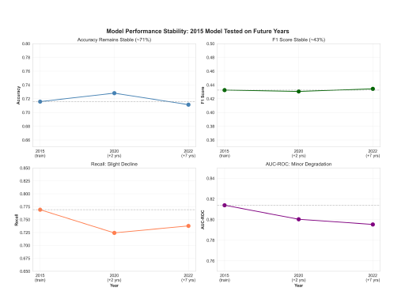
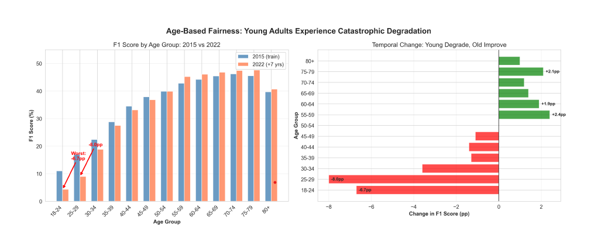
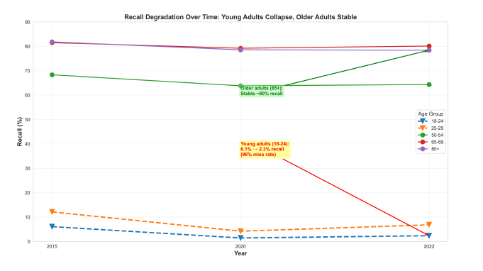
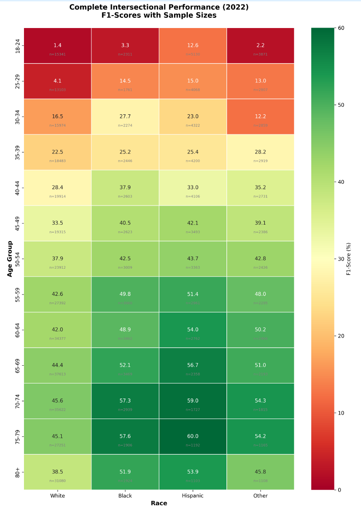

# 📉 Temporal Fairness Degradation in Diabetes Prediction Models

### When accuracy stays stable, but vulnerable groups fail.

---

## 🎯 Key Finding

A model trained on 2015 data maintained ~71% accuracy in 2022…

…but missed up to **97.7% of young diabetics**.

---

## 📊 Visual Overview

### Stability Paradox


### Age-Based Collapse


### Temporal Failure Progression


### Intersectional Failure


---

## 🚀 Overview

This project investigates how machine learning models in healthcare can appear reliable while silently failing vulnerable populations over time.

Using **CDC BRFSS data (2015–2022)** (~1.2M patients), we show:

- Temporal fairness degradation  
- Intersectional bias  
- Model sensitivity to subgroup shifts  
- Failure of standard retraining strategies  

---

## 🧠 Experiments

- Train on 2015 → test on 2020 & 2022  
- Bootstrap confidence intervals  
- XGBoost vs Logistic Regression  
- Retraining mitigation analysis  

---

## 📁 Project Structure
brfss-temporal-fairness/
├── paper/
├── results/
│ └── figures/
├── experiments/
├── requirements.txt
└── README.md


---

## 📄 Paper
Main paper: paper/MLHC.pdf
Supplementary: paper/supplementary.pdf

## ▶️ Run Experiments

```bash
pip install -r requirements.txt

python experiments/part1_load_and_verify.py
python experiments/part2_bootstrap_cis.py
python experiments/part3_lr_comparison.py
python experiments/part4_retraining.py
python experiments/part5_summary.py

