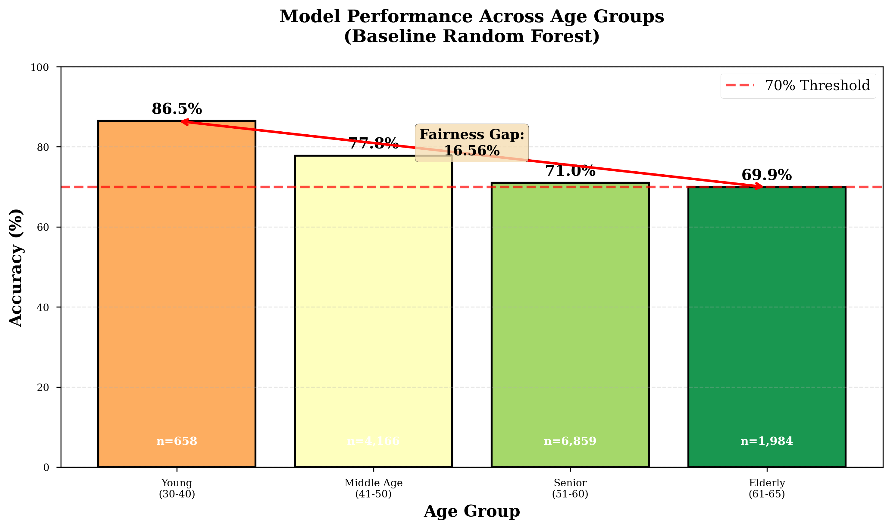
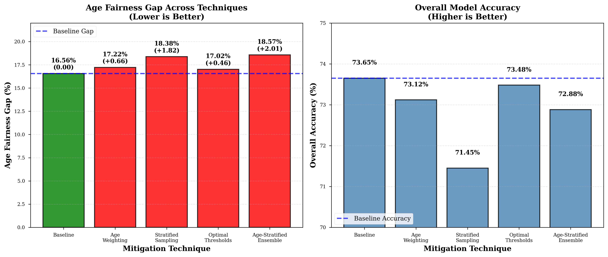
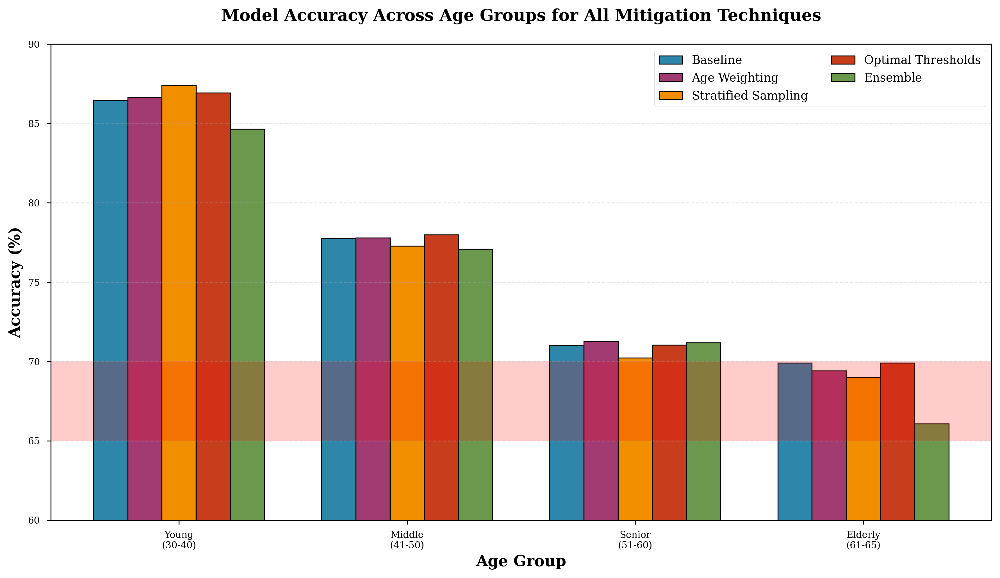
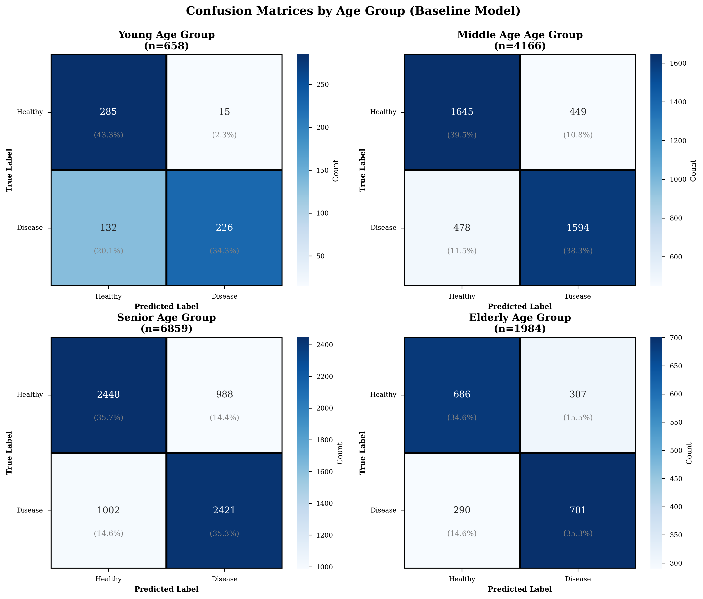
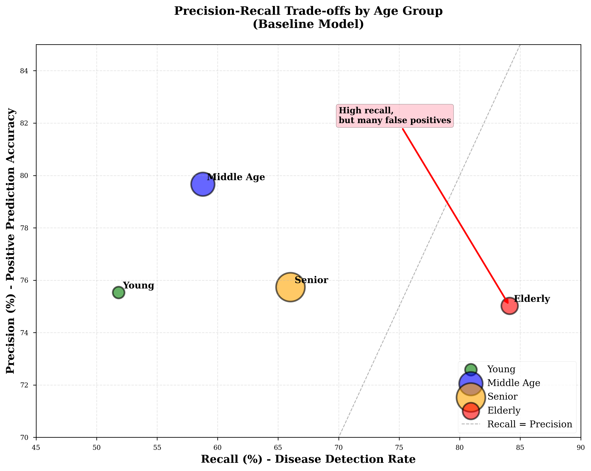
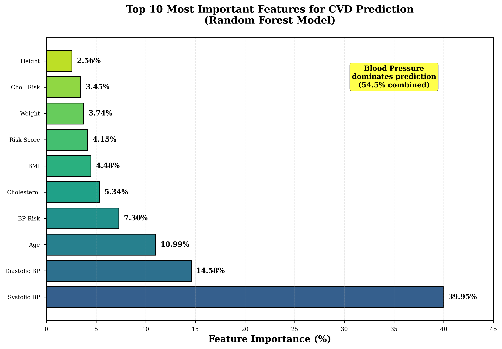
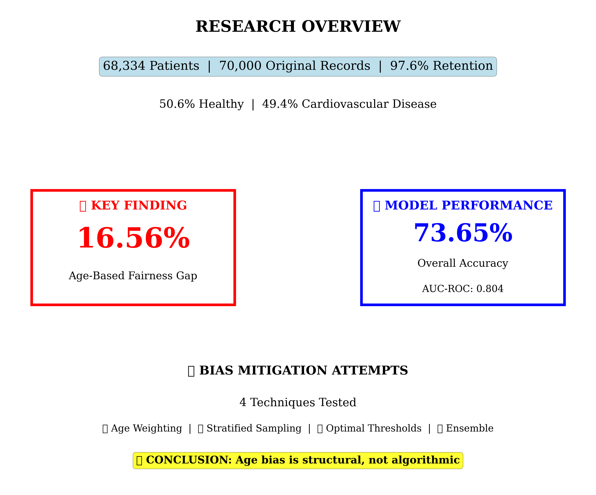

# 🧠 Age-Based Performance Disparities in Cardiovascular Disease Prediction

### When fairness cannot be fixed with better algorithms.

---

## 🚨 Key Finding

A machine learning model can appear highly accurate…

…but still fail certain populations.

In this study:

- Overall Accuracy: **73.65%**
- AUC-ROC: **0.804**

👉 Yet the model shows a **16.56% performance gap between young and elderly patients**

---

## 📊 Visual Overview

### 📈 Performance Across Age Groups (Baseline)



- Young patients: **86.47% accuracy**
- Elderly patients: **69.91% accuracy**
- Fairness gap: **16.56%**

---

### ⚠️ Bias Mitigation Results (All Techniques Failed)



We tested:

- Age-aware weighting  
- Stratified sampling  
- Threshold optimization  
- Age-specific ensemble models  

📉 Result:
- No technique reduced bias
- Some **increased the fairness gap**

---

### 📊 Accuracy Across All Techniques



👉 Elderly performance remains consistently low  
👉 Bias persists regardless of method  

---

## 🔍 Error Analysis

### 📉 Confusion Matrices by Age Group



Key insights:

- Young patients → high **false negatives**  
- Elderly patients → high **false positives**  

👉 Different groups fail in different ways

---

### ⚖️ Precision vs Recall Trade-offs



- Elderly → high recall, lower precision  
- Young → low recall (missed diagnoses)

👉 Model behaves inconsistently across age groups

---

## 🧠 Model Behavior

### 🔬 Feature Importance



- Blood pressure dominates (~54%)
- Age is important but not sufficient

👉 Model relies heavily on clinical features, but still fails elderly

---

## 📊 Research Summary



---

## 🧠 Core Insight

We attempted multiple fairness interventions:

- Reweighting samples  
- Balancing data  
- Changing decision thresholds  
- Training specialized models  

❌ None solved the bias problem  

---

## 🔥 Key Conclusion

> Age bias in healthcare ML is **structural, not algorithmic**

The elderly population:
- Has more complex medical patterns  
- Is harder to model with standard features  
- Requires domain-aware solutions  

---

## 🏥 Real-World Implications

Instead of blindly improving models, we should:

- Use ML as a **decision support tool**, not final authority  
- Add **human oversight for high-risk populations**  
- Continuously monitor fairness after deployment  

---

## 📄 Paper

📥 [Download Full Paper](paper/ML_Age_Fairness_Health (1).pdf)

---

## ⚙️ How to Run

### 1. Install dependencies

```bash
pip install -r requirements.txt
